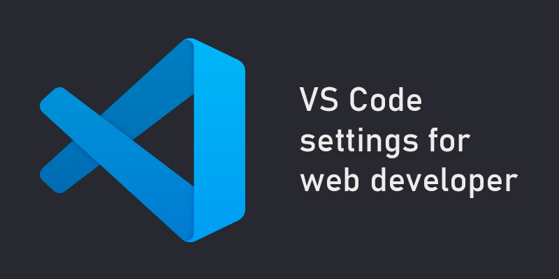

# SETTING UP THE "VISUAL STUDIO CODE" EDITOR / 28.04.2025

These settings and plugins for VS Code significantly boost your productivity, automate routine tasks, and help you write clean, organized code. They take care of tons of small stuff: creating files, closing tags, 
autocompleting classes and paths, formatting code, and even spell-checking variables and comments.

As a result, you spend less time on technical nitpicking and more on logic and creativity. Your code looks better, you work faster, make fewer mistakes, and see your changes instantly. Development stops feeling like 
tedious grunt work and becomes a fast, controlled process.

